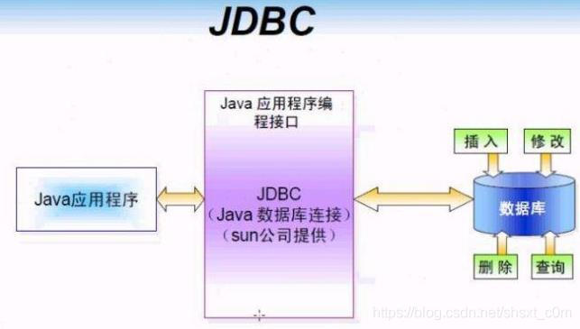
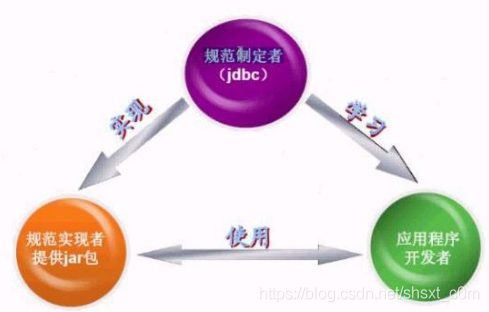

# 一、什么是JDBC
JDBC（Java Data Base Connectivity,Java数据库连接）是一种用于执行SQL语句的Java API，为多种关系数据库提供统一访问。 它由一组用Java语言编写的类和接口组成。

有了JDBC，程序员只需用JDBC API写一个程序，就可以访问所有数据库。将Java语言和JDBC结合起来使程序员不必为不同的平台编写不同的应用程序，只须写一遍程序就可以让它在任何平台上运行，这也是Java语言“编写一次，处处运行”的优势。

# 二、JDBC API
提供者：Sun公司

内容：供程序员调用的接口与类，集成在java.sql和javax.sql包中，如

DriverManager类 作用：管理各种不同的JDBC驱动
Connection接口
Statement接口
ResultSet接口

# 三、JDBC 驱动
提供者：数据库厂商

作用：负责连接各种不同的数据库

JDBC对Java程序员而言是API，对实现与数据库连接的服务提供商而言是接口模型。

# 四、 三方关系
SUN公司是规范制定者，制定了规范JDBC（连接数据库规范）。数据库厂商微软、甲骨文等分别提供实现JDBC接口的驱动jar包。程序员学习JDBC规范来应用这些jar包里的类。

 

# 五、JDBC访问数据库步骤

1：加载一个Driver驱动

2：创建数据库连接（Connection）

3 ：创建SQL命令发送器Statement

4：通过Statement发送SQL命令并得到结果

5：处理结果（select语句）

6：关闭数据库资源

* ResultSet
* Statement
* Connection