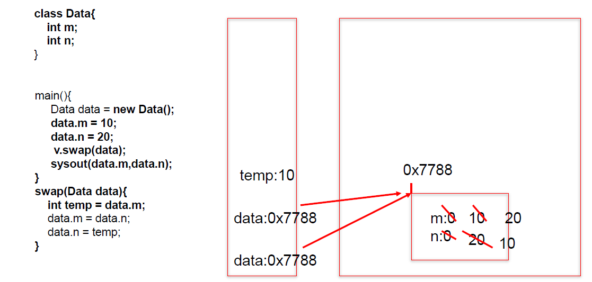

# 方法的重载（overload）：

同一个类，方法名一致，参数列表不同（参数个数不同，参数类型不同，参数个数和类型都不同）。

和访问权限修饰符，返回值类型，参数名，方法体没有关系。

# 可变个数形参：

格式：

* 1.5之前：数组参数（main函数）
* 1.5以后：参数类型 ... 参数名

必须声明在参数列表末尾，所以形参列表中只能存在一个可变个数形参。

调用时，可以传入0个参数，或多个参数。

# 参数的值传递

* 基本数据类型：实参将数据值赋给形参
* 引用数据类型：实参将对象的地址值赋给形参

# 递归

定义：方法体中调用自身