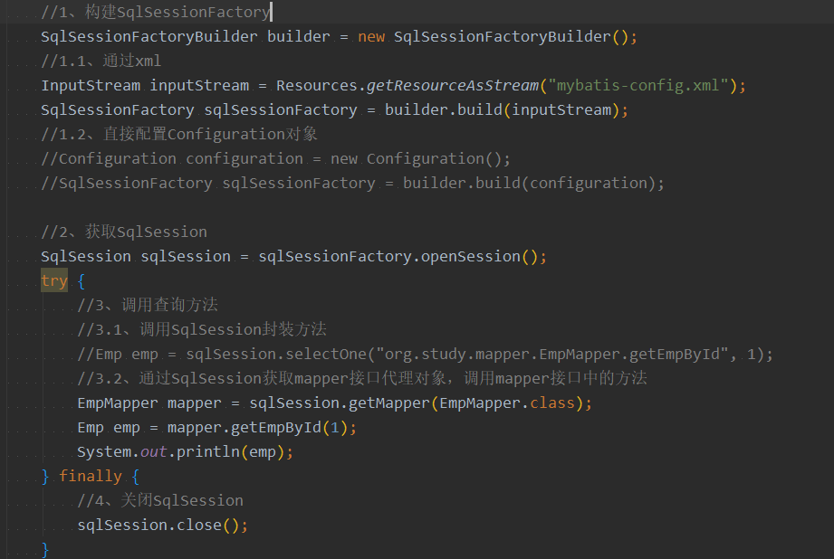
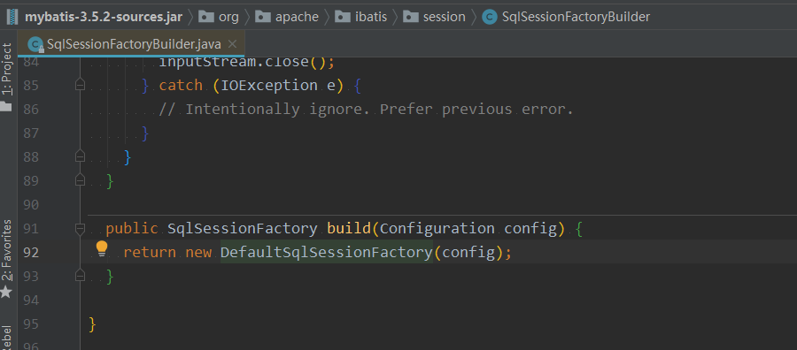
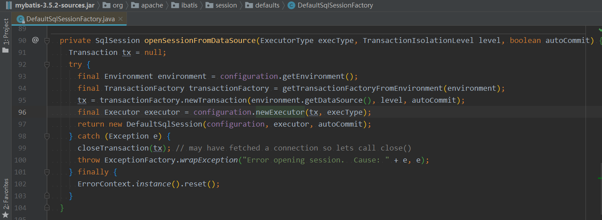
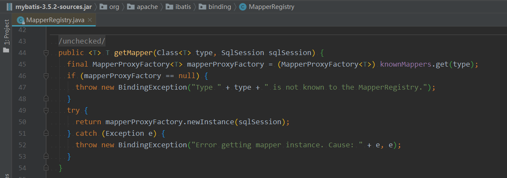
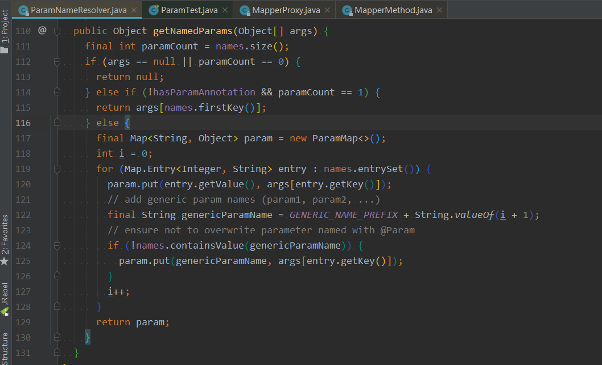
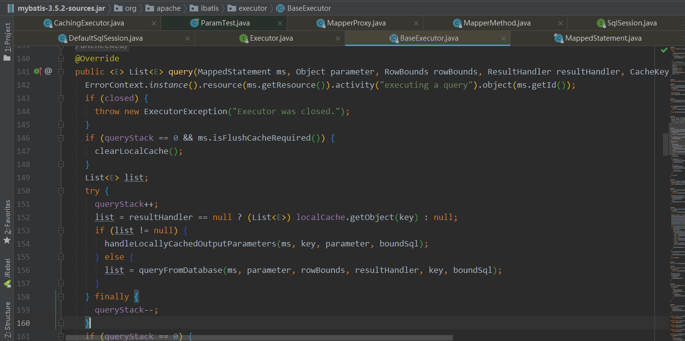
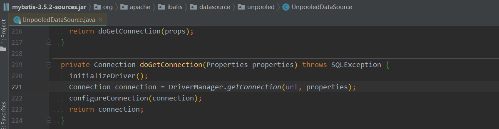
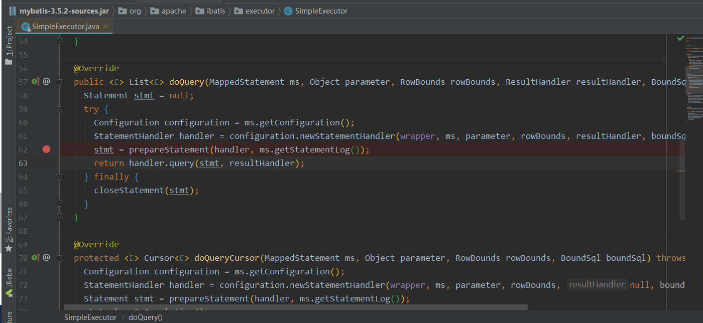
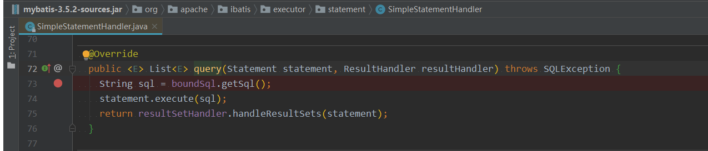

[Mybatis 官方中文文档](https://mybatis.org/mybatis-3/zh/)

# HelloWorld

mybatis工作原理：

1. 构建SqlSessionFactory（两种方式是一个原理。最后都是要配置Configuration对象。）
   * 基于xml
   * 不使用xml，直接配置Configuration对象。
2. 从SqlSessionFactory中获取SqlSession（sqlSessionFactory.openSession()）
3. SqlSession调用查询方法
   * 调用 SqlSession 封装方法
   * 通过 SqlSeesion 获取mapper接口的代理对象，调用mapper接口中的方法 
4. 关闭 SqlSession

# 源码解析

1、SqlSessionFactoryBuilder.build()：解析全局配置xml，初始化Configuration对象。

2、SqlSessionFactory.openSession()：初始化DefaultSqlSession对象。配置configuration，executor，autoCommit属性。

3、SqlSession.getMapper()：获取mapper接口的代理对象。

4、调用mapper接口方法：解析mapper.xml，封装查询参数，判断缓存中是否有查询结果，有的话返回缓存中的结果。没有的话，就查数据库。调用jdbc，注册驱动，创建连接，创建SQL命令发送器Statement，Statement发送sql，执行返回结果并封装。关闭资源

4.1、封装查询参数：封装策略详见笔记2。

4.2、判断缓存中是否有查询结果，有的话返回缓存中的结果。没有的话，就查数据库。

4.3、调用 jdbc API，注册驱动，创建连接

4.4、创建SQL命令发送器Statement

4.5、Statement发送sql，执行返回结果并封装。

4.6、关闭资源：ResultSet，Statement返回结果后就会自动关闭。Collection需要我们调用SqlSession.close()来手动关闭。

