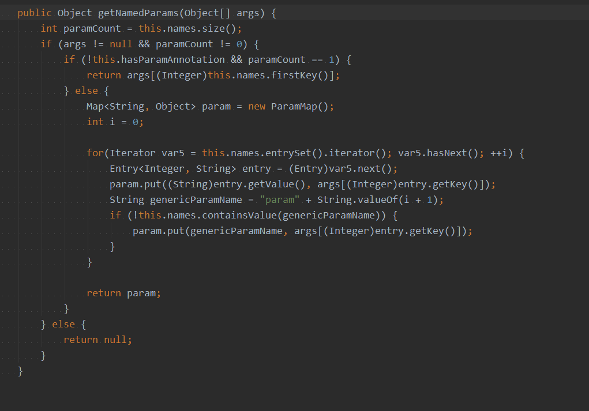

插入返回自增主键：

* 支持自增主键的数据库（mysql）

  1. useGeneratedKeys 属性设置为 true

  2. 通过 keyProperty 属性，将自增的主键绑定在 JavaBean 的属性上
* 不支持自增主键的数据库（oracle）
  * 先查询，后插入
    1. 通过 selectKey 标签查出下一个序列号，绑定到 JavaBean 属性上
    2. 运行插入 sql，取出 id

  * 先插入，后查询
    1. 运行插入 sql
    2. 通过 selectKey 标签查出当前序列号，绑定到 JavaBean 属性上

参数处理：

* 单个参数：#{} 中随便写

* 多个参数：

  * 默认：参数封装成了map，key：arg0...argN-1 和 param1...paramN
  
  * 自定义：可以通过@Param自定义key，key：自定义名称 和  param1...paramN
  
    org.apache.ibatis.reflection.ParamNameResolver
  
  
  
  多个参数时，可以封装为 JavaBean 或 Map。