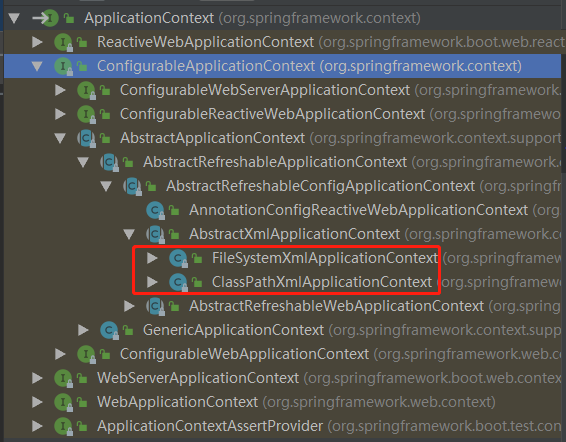

IOC(Inversion of Control)：控制反转

IOC 目的：解耦

IOC 原理：xml解析 + 工厂模式 + 反射

IOC 接口：

1. BeanFactory：一般供spring内部使用。加载配置文件时，不会创建对象；在获取对象时才会去创建对象。
2. ApplicationContext：BeanFactory的子接口。一般供开发人员使用。加载配置文件时，就会创建配置文件中配置的对象。

ApplicationContext 接口实现类：

FileSystemXmlApplicationContext：在指定的文件系统路径下查找xml文件。

ClassPathXmlApplicationContext：在类路径下查找xml文件。

---

IOC 操作 Bean 管理：

Bean 管理指的是两个操作：1、Spring 创建对象。2、Spring 注入属性。

Bean 管理有两种方式：1、基于xml 配置文件方式。2、基于注解方式。

